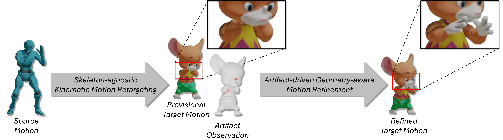

# [SIGGRAPH Asia 2026] Skinned Motion Retargeting via Artifact-driven Kinematic Prior Refinement



Official implementation of *Skinned Motion Retargeting via Artifact-driven Kinematic Prior Refinement* (SIGGRAPH Asia 2026 / ACM Transactions on Graphics).

[](https://arxiv.org/abs/2609.06517)
[](https://seokhyeonhong.github.io/projects/kinematic-refinement/)
[](https://www.youtube.com/watch?v=gpWf8LOA6eQ)


## ⚙️ Installation
Install the system dependency:

```bash
sudo apt-get install freeglut3-dev
```

Create and activate the conda environment, then install the Python dependencies:

```bash
conda create -n kinref python=3.8
conda activate kinref
bash install.sh
```

Our environment uses Python 3.8 and PyTorch 2.4.1 built for CUDA 12.1.
To use another PyTorch or CUDA version, update both the PyTorch and PyTorch Geometric package URLs in `install.sh` ([PyTorch Versions](https://pytorch.org/get-started/previous-versions/)).
The installation script also installs the bundled Fairmotion fork from `src/fairmotion`.

## 🚀 Pretrained Models and Datasets

The pretrained checkpoints are included in:

```text
result/
├── kin/
│   ├── config.yaml
│   ├── last_model.pt
│   └── ms_dict.pt
└── geo/
    ├── config.yaml
    ├── last_model.pt
    └── ms_dict.pt
```

Download the datasets from [Google Drive](https://drive.google.com/drive/folders/1GNW5wY71BwRY9y0pJLLJ-dAPEmU_1MgN?usp=sharing) and extract them under `data/`.

The resulting layout should include:

```text
data/
├── train_kin/
├── train_geo/
├── test_kin_fixed_sc/
├── test_kin_fixed_uc/
├── test_kin_arbitrary_sc/
├── test_kin_arbitrary_uc/
├── test_geo_sc/
└── test_geo_uc/
```

Here, `kin` and `geo` denote the kinematic and geometry-aware stages.
`sc` and `uc` denote seen and unseen target characters, respectively.

## 🏃‍♂️ Training

Run the following commands from the repository root after activating the `kinref` environment.
Each training script creates its output experiment directory and raises an error rather than overwriting an existing experiment.

### Kinematic Prior

The final kinematic configuration is `config/kin_config.yaml`, which uses `data/train_kin/motion/processed`.

```bash
# Run from the repository root.
cd src
python -m kinref.kin_train \
  --cfg kin_config \
  --exp kin_custom \
  --device cuda:0
```

Checkpoints and TensorBoard logs are written to `result/kin_custom`.

### Geometry-aware Refinement

The final geometry configuration is `config/geo_config.yaml`, which uses `data/train_geo/motion/processed`.
Geometry training loads the kinematic checkpoint specified by `model.pretrained.model_epoch`.
The provided configuration uses `result/kin/last_model.pt`.
To refine a custom kinematic model, change that field to the corresponding experiment name before training.

```bash
# Run from the repository root.
cd src
python -m kinref.geo_train \
  --cfg geo_config \
  --exp geo_custom \
  --device cuda:0
```

Checkpoints and TensorBoard logs are written to `result/geo_custom`.

## 🤖 Inference

`--model_epoch` accepts either an experiment name such as `kin` or a numeric checkpoint such as `kin/100`.
The `/latest` suffix is not supported; use the experiment name to load `last_model.pt`.

Run kinematic retargeting and save the result as a BVH file:

```bash
# Run from the repository root.
cd src
python -m kinref.kin_test \
  --model_epoch kin \
  --data_dir test_kin_fixed_sc/motion/processed \
  --device cuda:0 \
  --rnd_tgt 0 \
  --src_mask 0 \
  --tgt_mask 0
```

Run geometry-aware retargeting and save the result as a BVH file:

```bash
# Run from the repository root.
cd src
python -m kinref.geo_test \
  --model_epoch geo \
  --data_dir test_geo_uc/motion/processed \
  --device cuda:0
```

## ✏️ Evaluation

### Kinematic Retargeting
```bash
# Run from the repository root.
cd src
python task/kin_eval/table1.py \
  --model_epoch kin \
  --data_dir test_kin_fixed_sc/motion/processed \
  --device cuda:0
```

Change `--data_dir` to one of the other `test_kin_*` splits as needed.

### Geometry-aware Retargeting
```bash
# Run from the repository root.
cd src
python task/geo_eval/table2.py \
  --model_epoch geo \
  --data_dir test_geo_sc/motion/processed \
  --device cuda:0

python task/geo_eval/table2.py \
  --model_epoch geo \
  --data_dir test_geo_uc/motion/processed \
  --device cuda:0
```

The geometry evaluation reports the enabled motion metrics together with mesh penetration ratio and depth.
The geometry model computes Jacobian features with autograd, so do not wrap its full forward pass in `torch.no_grad()` or `torch.inference_mode()`.

## 📖 Custom Data

Motion preprocessing follows the pipeline from [SAME](https://github.com/sunny-Codes/SAME#1-data-preprocess), on which this repository is based.
A processed motion dataset must contain `motion/processed/pair.txt` and the referenced `.npz` files.

For geometry-aware refinement, additionally preprocess the skinned character meshes with:

```text
src/preprocess/preprocess_mesh.py
```

The mesh preprocessing code depends heavily on [aPyOpenGL](https://github.com/seokhyeonhong/aPyOpenGL), which must be configured separately.

After preprocessing, set `train_data.dir` in a copy of `config/kin_config.yaml` or `config/geo_config.yaml` to the new dataset path relative to `data/`.


## 🙏 Acknowledgements

* This codebase builds on [SAME](https://github.com/sunny-Codes/SAME) and its skeleton-agnostic motion representation and downstream utilities.
* We also thank [Retargeter](https://github.com/eksod/Retargeter) for MotionBuilder python scripts
* We adopted [fairmotion](https://github.com/facebookresearch/fairmotion) library modified by SAME: [modified version](https://github.com/sunny-Codes/fairmotion/tree/895e15e8e0a8ae85f2315a5706402ffe0715f53f).

## 📜 Citation

```
@article{hong2026skinned,
  title={Skinned Motion Retargeting via Artifact-driven Kinematic Prior Refinement},
  author={Hong, Seokhyeon and Kim, Chaelin and Jang, Inseo and Choi, Soojin and Noh, Junyong},
  journal={arXiv preprint arXiv:2609.06517},
  year={2026}
}
```

## ✉️ Contact

Seokhyeon Hong: graphics.shong@gmail.com
